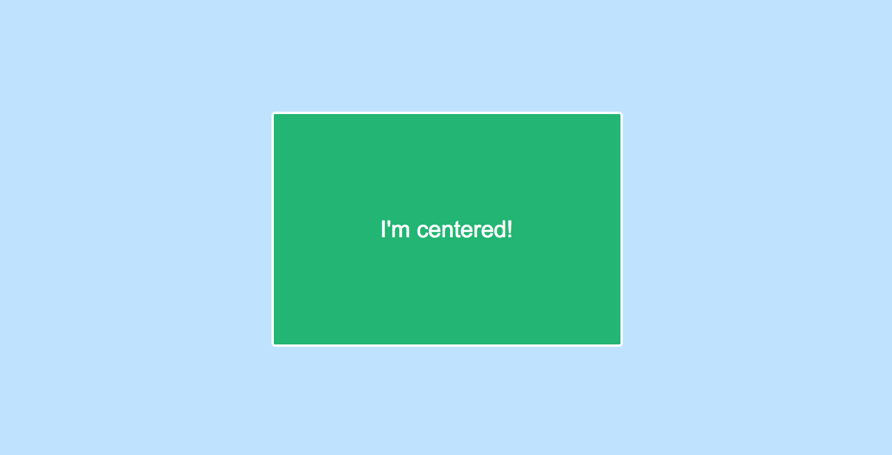
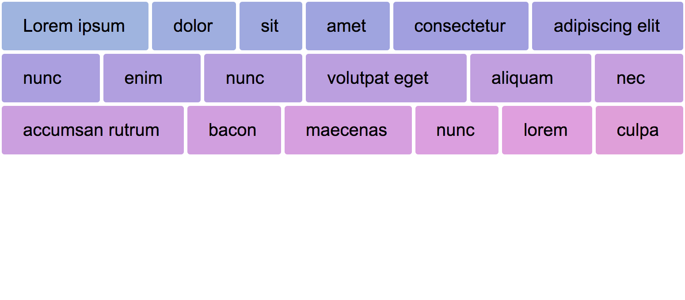
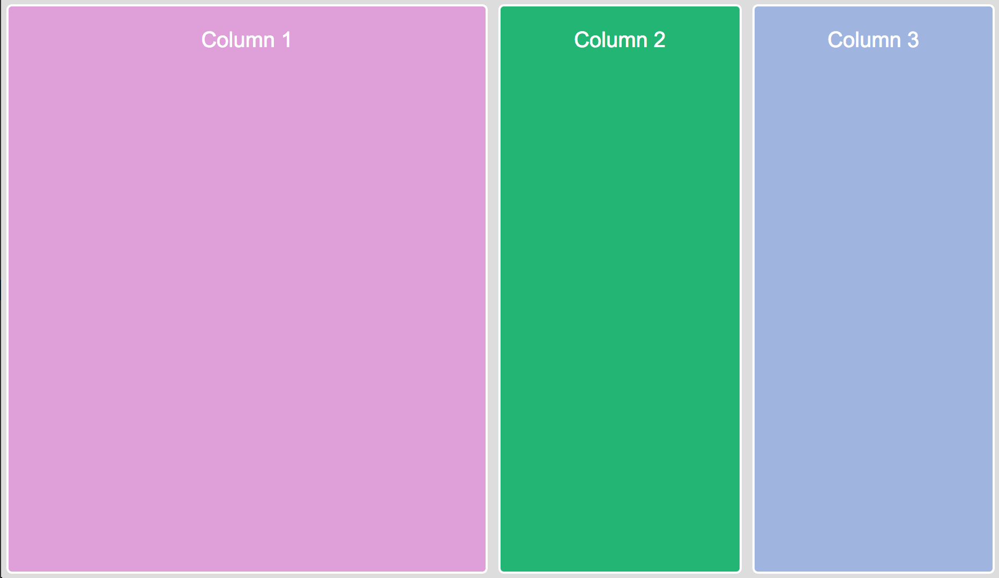
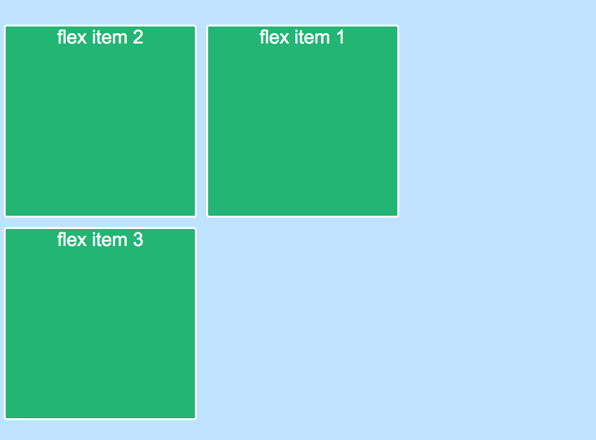
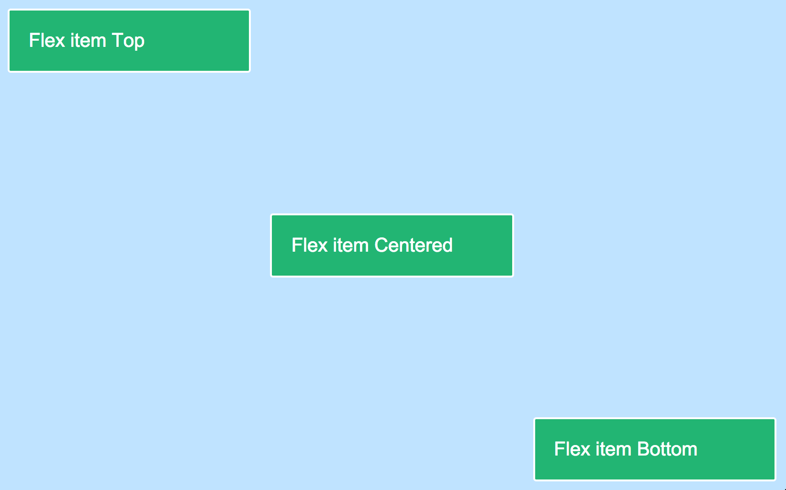

## DESCRIPTION:

This task consist of 5 parts that should be solved using Flexbox layout model.

You should edit only `task.css` to sattisfy requirements and achieve look provided in `examples` folder.

Each part has two states for **large screens** (larger than 500px) and **small screens** (in range from 400px to 500px).
Horizontal scrollbar should appear for screens smaller that 400px.

> **NOTE:** You shoud create media query for separately for each part and add code according to comments in `task.css`. This will make checking your task easier.

> **NOTE:** You should not edit `index.html` and `default.css` files, and override only necessary styles in `task.css`.

## REQUIREMENTS:

### Part 1

**On the large screen**:
Item(green block) inside the container should be centered both horizontally and vertically independently from its contents size.

**On the small screen**:
Item should occupy all container width and height.

### Part 2

**On the large screen**:
Items should stretch equally to fill full available space in a row.
If there are not enough space - items should wrap to next line.

**On the small screen**:
Items must be aligned by 2 items in a row and have same margins between them.
If there are two items in a row - items should have equal size and occupy all container width.
If item, is the only one element that remains in a row - it should take full available width.

### Part 3

**On the large screen**:
Items in the container should be displayed in three columns that occupy full container height.
The first flex item should consume half of the free space, and the other two flex items should consume remaining free space in equal proportions.

**On the small screen**:
Items should be aligned in two rows, where first row is occupied fully by first flex item.
Two other items should be on the second row and consume remaining free space in equal proportions (as before).

### Part 4

**On the large screen**:
Items should be reordered to match nexx order: first should be `flex item 2`, then `flex item 1`, and the last one `flex item 3`.
Items should be moved to another row they can't fit container.

**On the small screen**:
Items should have same order as described above, but should occupy the entire width of the container and be located one below the other.

### Part 5

**On the large screen**:
Each item should be aligend according to text in its content.

**On the small screen**:
Items should occupy full width of the container and si

Support all major browsers:
 * Chrome
 * Firefox
 * Edge
 * IE 11
 * Safari

## WORKFLOW:
Add necessary styles to `task.css` according to comments inside it.

Commit all files to git into

branch `04-markup-advanced`

folder `04-markup-advanced/03-flexbox-and-grid/task-01`

Result structure should be the same as provided with task.

## SOURCES:

`index.html` and `default.css` - contain all necessary markup and page styles. Students shouldn't edit this files.
`task.css` - file where all styles should be applied.
`examples` - foolder that contains examples of expected layout for each task part.

## DEADLINE:

Due Date - 04-02-2019 23:59.

Penalty will be applied for each overdue day.
